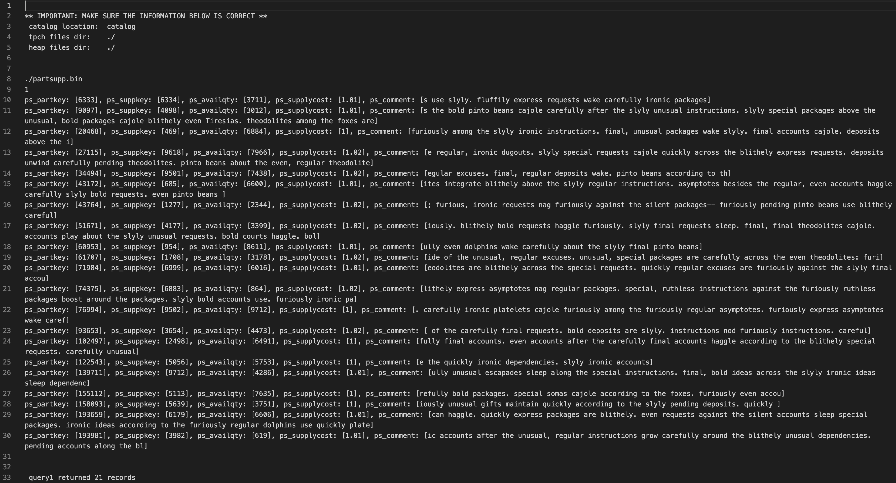
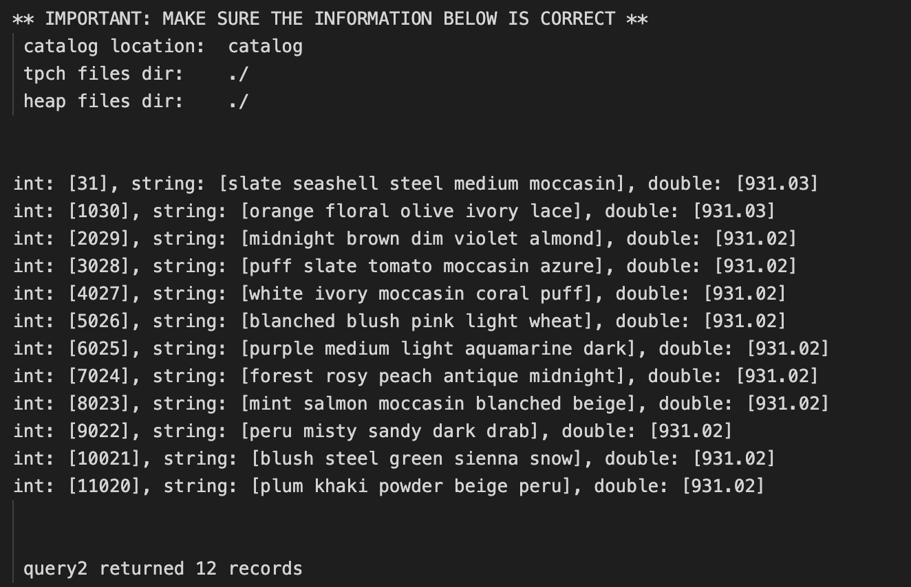
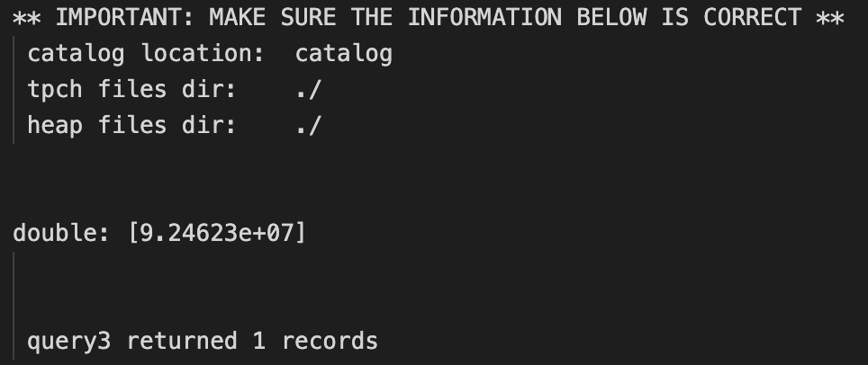
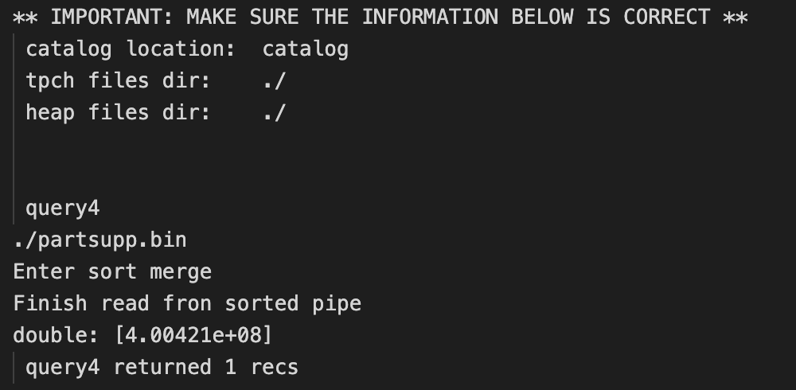
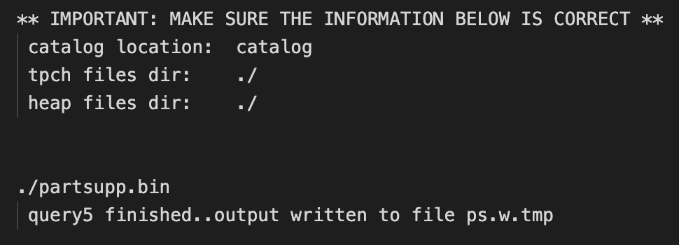
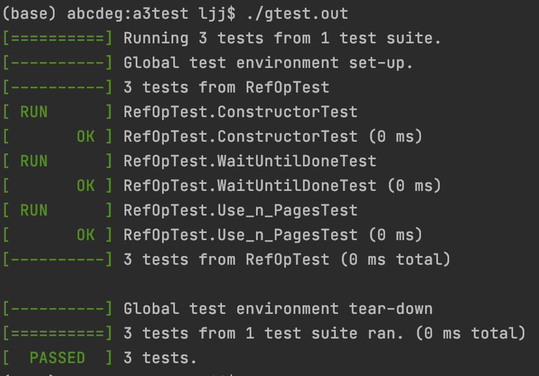

# [proj3 Relational Operations](/P3)

- Haocheng Song(UFID: 11851321)
- Jiajing Liao(UFID: 01469951) 

## Usages
1. change directories in "a2-test.cc"

2. To generate the .bin files
```
make clean
make a2test.out
./a2test.out
```

3. To tun the test.cc
```
make
./test.out [1-8]
```

### Gtest Usage
```
make gtest
./gtest.out
```

## Major works
- implements all class in RelOp.cc
- write gtest for major methods
- write documents for explanation and results


## Method documentation

void SelectFile::Run (DBFile &inFile, Pipe &outPipe, CNF &selOp, Record &literal) will take a DBFile as input and apply CNF to each record extracted, then output it to the out Pipe if valid. It will start a new thread in "void* workerMain1(void* arg)"

void SelectFile::WaitUntilDone (): theoretically, this method should block the thread, but this will lead to the stuck of "test.cc", so I comment the block.

void SelectPipe::Run (Pipe &inPipe, Pipe &outPipe, CNF &selOp, Record &literal) will take a Pipe as input and apply CNF to each record extracted, then output it to the out Pipe if valid. It will start a new thread in "void* workerMain2(void*arg)"

void Sum::Run (Pipe &inPipe, Pipe &outPipe, Function &computeMe) will take a Pipe as input, compute the sum result based on Type, which can be either Int or Double, then it will generate the Schema and Records accordingly and send it into output Pipe. It will start a new Thread in "void* workerMain3(void*arg)"

void GroupBy::Run (Pipe &inPipe, Pipe &outPipe, OrderMaker &groupAtts, Function &computeMe) will use a BigQ to sort the input Pipe, and obtain a sorted Pipe from the BigQ output. Then From the sorted Pipe, it will compare current record with previous record. If they are the same, then they are still in the same group. Otherwise, they are in the different group, which will trigger the operation that write the previous group into a records and send it into output Pipe. It will start a new Thread in "void* workerMain4(void*arg)"

void GroupBy::Use_n_Pages (int n): here the n will be the maximum pages that BigQ can use.

## Result of test.cc and gtest

q1

q2

q3

q4

q5


Gtest
