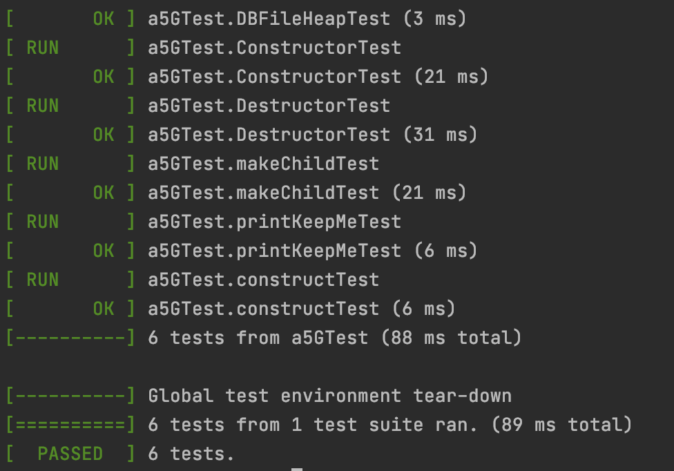

# [proj5 Relational Operations](/P3)

- Haocheng Song(UFID: 11851321)
- Jiajing Liao(UFID: 01469951) 

### video demonstration: https://youtu.be/gVZKlBUw_ms

## Usages

To run the SQL sentences
```
make clean
make
./a5.out
```
Then input the SQL sentences: [Some SQL sentences you can use](#some-SQL-sentences-you-can-use)

### File Location
I've provide the 10M tpch and bin file in below directories, you dont need extra setting.
- tpch file location: ./tpch/
- bin file location: ./bin/


### Gtest Usage
```
make gtest
./gtest.out
```

## Major works
- Add Apply() in NodeForQuery.cc and NodeForQuery.h for actually apply the execution
- Add Create, Insert, Drop, Set, etc in main.cc, parser.y and lexer.l
- Add change to catalog logics
- write documents for explanation and results
- write gtest for major methods
- pass all gtest cases in **gtest.cc**


## Result of output5.txt and gtest

Result of output5.txt
```
TC1

Enter your SQL: 

You Sql has been parsed
Optimal Plan has been built

Current OUTPUT MODE: STDOUT
--------------
-------------------
n.n_nationkey: [24]
Total Count: 1

***************************************************************************************************************************
TC2

Enter your SQL: 

You Sql has been parsed
Optimal Plan has been built

Current OUTPUT MODE: STDOUT
--------------
-------------------
n.n_name: [MOZAMBIQUE]
-------------------
n.n_name: [MOROCCO]
-------------------
n.n_name: [KENYA]
-------------------
n.n_name: [PERU]
-------------------
n.n_name: [UNITED STATES]
-------------------
n.n_name: [CHINA]
-------------------
n.n_name: [INDONESIA]
-------------------
n.n_name: [JAPAN]
-------------------
n.n_name: [VIETNAM]
-------------------
n.n_name: [INDIA]
-------------------
n.n_name: [GERMANY]
-------------------
n.n_name: [ROMANIA]
-------------------
n.n_name: [RUSSIA]
-------------------
n.n_name: [UNITED KINGDOM]
-------------------
n.n_name: [FRANCE]
-------------------
n.n_name: [JORDAN]
-------------------
n.n_name: [IRAN]
-------------------
n.n_name: [SAUDI ARABIA]
-------------------
n.n_name: [IRAQ]
Total Count: 19

***************************************************************************************************************************
TC3

Enter your SQL: 

You Sql has been parsed
Optimal Plan has been built

Current OUTPUT MODE: STDOUT
--------------
-------------------
SUM: [24]
Total Count: 1

***************************************************************************************************************************
TC4

Enter your SQL: 

You Sql has been parsed
Optimal Plan has been built

Current OUTPUT MODE: STDOUT
--------------
-------------------
SUM: [1]
Total Count: 1

***************************************************************************************************************************
TC5

Enter your SQL: 

You Sql has been parsed
Optimal Plan has been built

Current OUTPUT MODE: STDOUT
--------------
-------------------
SUM: [268287]
-------------------
SUM: [257125]
-------------------
SUM: [341936]
-------------------
SUM: [442436]
-------------------
SUM: [333702]
Total Count: 5

***************************************************************************************************************************

```



## Method documentation

main.cc contains all logics control about Select, Create, Insert, Drop, etc, it will first parse the input SQL sentence by yyparse(), and then construct the Node Tree Structure, find out the best path by estimation, then it can actually run the SQL query following the best path in the tree.

void JoinNode::Apply() will actually run the Join Operations, it will firstly call it's parent's Apply, Then it's parent's out pipe will be the input pipe of this Node, after processing, it will output it's pipe into it's child.

void SelectFileNode::Apply() will actually run the SelectFile Operations, it will open a file and then send the records into pipe, Then after processing, it will output it's pipe into it's child.

void SelectPipeNode::Apply() will actually run the SelectPipe Operations, it will firstly call it's parent's Apply, Then it's parent's out pipe will be the input pipe of this Node, after processing, it will output it's pipe into it's child.

void ProjectNode::Apply() will actually run the Project Operations, it will firstly call it's parent's Apply, Then it's parent's out pipe will be the input pipe of this Node, after processing, it will output it's pipe into it's child. It will only preserve the required attributes.


void SumNode::Apply() will actually run the Sum Operations, it will firstly call it's parent's Apply, Then it's parent's out pipe will be the input pipe of this Node, after processing, it will output it's pipe into it's child. It will only preserve 1 attributes, "SUM".


void DuplicateRemovalNode::Apply() will actually run the DuplicateRemoval Operations, it will firstly call it's parent's Apply, Then it's parent's out pipe will be the input pipe of this Node, after processing, it will output it's pipe into it's child. It's out schema will be the same to input schema.


void GroupByNode::Apply() will actually run the GroupBy Operations, it will firstly call it's parent's Apply, Then it's parent's out pipe will be the input pipe of this Node, after processing, it will output it's pipe into it's child. it has to be used with SUM.


void WriteOutNode::Apply() will actually run the WriteOut Operations, it will firstly call it's parent's Apply, Then it's parent's out pipe will be the input pipe of this Node, after processing, it will output it's pipe into a file.

## Some SQL sentences you can use
```
CREATE TABLE nation ( n_nationkey INTEGER, n_name STRING, n_regionkey INTEGER, n_comment STRING ) AS HEAP
INSERT 'nation.tbl' INTO nation
DROP TABLE nation

CREATE TABLE region ( r_regionkey INTEGER, r_name STRING, r_comment STRING ) AS HEAP
INSERT 'region.tbl' INTO region

CREATE TABLE customer ( c_custkey INTEGER, c_name STRING, c_address STRING, c_nationkey INTEGER, c_phone STRING, c_acctbal DOUBLE, c_mktsegment STRING, c_comment STRING ) AS HEAP
INSERT 'customer.tbl' INTO customer
DROP TABLE customer

SET OUTPUT STDOUT
SET OUTPUT 'aaabbb.ccc'
SET OUTPUT NONE

CREATE TABLE partsupp ( ps_partkey INTEGER, ps_suppkey INTEGER, ps_availqty INTEGER, ps_supplycost DOUBLE, ps_comment STRING ) AS HEAP
INSERT 'partsupp.tbl' INTO partsupp

CREATE TABLE part ( p_partkey Int, p_name String, p_mfgr String, p_brand String, p_type String, p_size Int, p_container String, p_retailprice Double, p_comment String ) AS HEAP
INSERT 'part.tbl' INTO part

CREATE TABLE supplier ( s_suppkey Int, s_name String, s_address String, s_nationkey Int, s_phone String, s_acctbal Double, s_comment String ) AS HEAP
INSERT 'supplier.tbl' INTO supplier
```

## Existing Bugs

The program usually crash with **Segmentation fault: 11**, in such situation, just exit and reenter the program, then everything will be fine. This may related to memory leak, but we cannot solve this problem due to limited time. Whatever, it's not key point of this project.


## BUG Report

When doing yyparse() in a while loop, you have to clear some flag, otherwise the while loop will not end. As demonstrated here: https://ufl.instructure.com/courses/418634/discussion_topics/2913007
```
while(1){
    yyparse();
    cin.clear();
    clearerr(stdin);
}

```