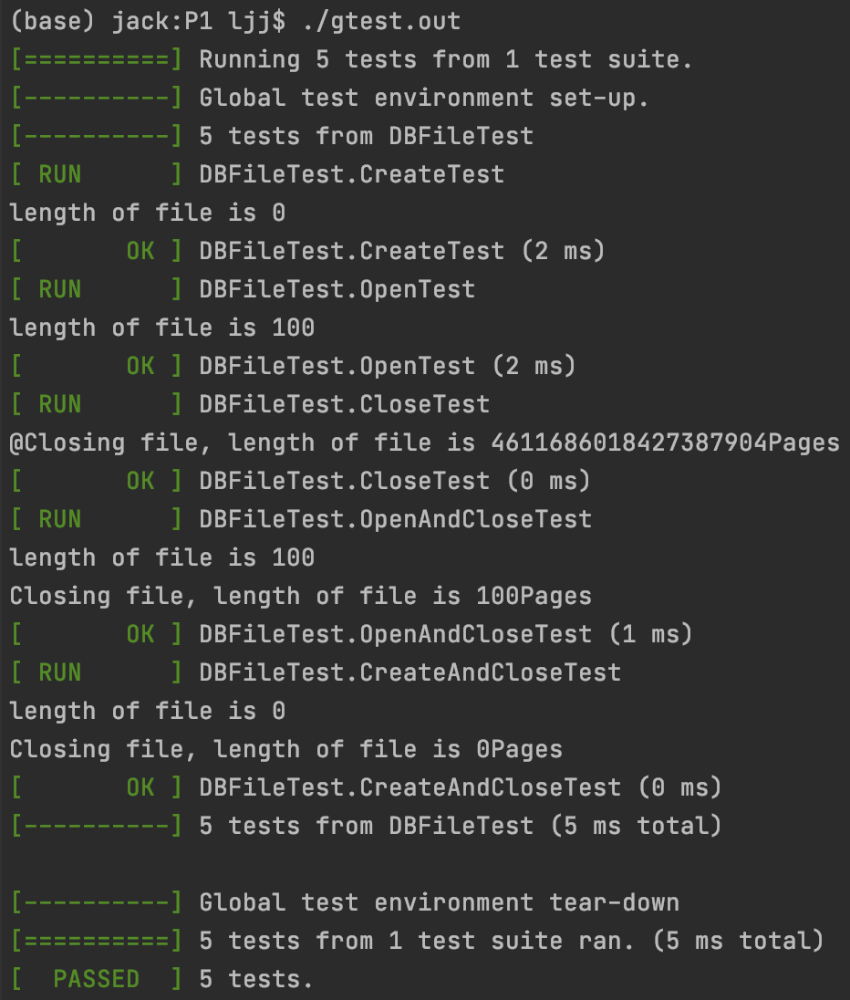
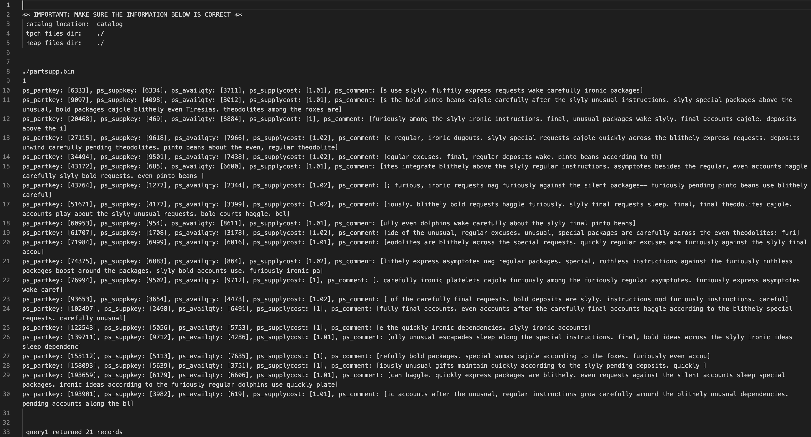
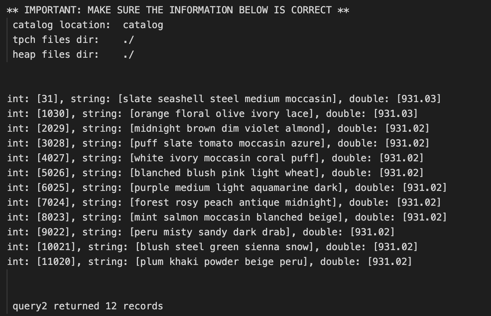
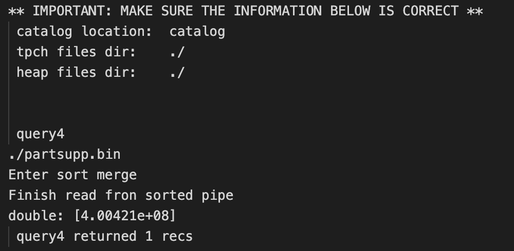
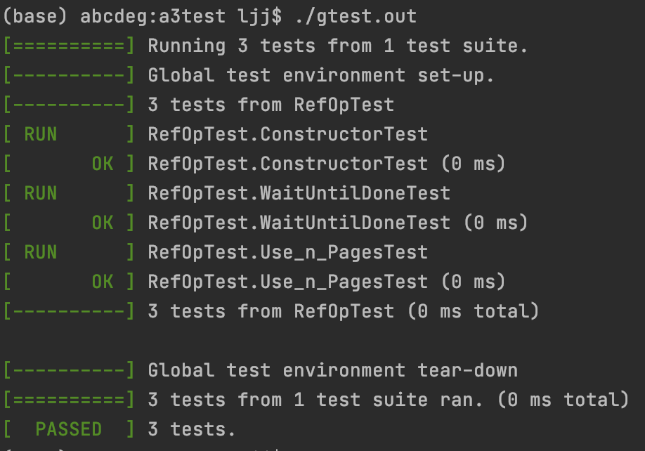

# This is my course project of COP6726 Database System Implementation


# [proj1 Heap file implementation](/P1)

## Abstract
A Heap File System consists of many pages, all of them will be stored in the disk except one buffer page.

The writing will only be allowed at the end of the file. O(1)

The reading can only start from the beginning of this file.
- when record is in file, O(n/2)
- when record is not in the file, O(n)

For editing, it will requires for a scan of the file, and the time complexity will be the same with reading.

## Implementation
For writing, new records will be stored temporarily at the the buffer page. when this buffer page is full, it will be write into disk/file.
For reading, a page of records will be read from disk each time, and there will be a pointer which indicating the current position of records, and this pointer could be moved to the next record.

*.tbl is text database file generated by tpch-dbgen
*.bin is the binary file generated and will be consumed by this program
fopen of C++ will be able to open a *.tbl file
DBFile.open() will be able to open a *.bin file


## Google Test

Usage
We change the Makefile in order to use Google Test

```
make clean
make gtest
./gtest.out
```


Results of gtest:



#### Reference for gtest
installation
https://github.com/google/googletest/blob/master/googletest/README.md#standalone-cmake-project

Turtorial
https://github.com/google/googletest/blob/master/docs/primer.md


## Common Mistakes in C++

## Directory problem
remember to add `/` at the last of a directory:
`const char *tpch_dir ="/Users/ljj/Documents/Courses/0 courses/DBSI/projects/tpch-dbgen/";` instead of `const char *tpch_dir ="/Users/ljj/Documents/Courses/0 courses/DBSI/projects/tpch-dbgen";`

## How to compile

Refer to Assignment page for generating date
```shell
mkdir ~/git; cd git; git clone https://github.com/electrum/tpch-dbgen.git 
make
./dbgen -s 0.01
```

## PLAN A
line 41 of makefile
```shell
	sed $(tag) y.tab.c -e "s/  __attribute__ ((__unused__))$$/# ifndef __cplusplus\n  __attribute__ ((__unused__));\n# endif/" 
```
should be change to
```shell
	sed $(tag) -e "s/  __attribute__ ((__unused__))$$/# ifndef __cplusplus\n  __attribute__ ((__unused__));\n# endif/" y.tab.c
```

But still, there is segment fault

## PLAN B connect to CISE thunder computer
connect to VPN of UFL
, `ssh liao@thunder.cise.ufl.edu`, also segment fault

copy folder: https://unix.stackexchange.com/questions/374823/how-to-copy-directories-via-ssh

**When compiling in CISE Machine, you have to delete `-O2`, otherwise there might be problems. My problem is that I cannot open my file again after I close it.**

## Bugs already known
While printing, Double variable will only display some part of it. However, this doesn't influence the accuracy of query.
So, please refer to the number in the *.tbl files instead of print out result.

## more tips for easing make and make clean by alias
```
alias mt='make test.out'
alias mm='make main'
alias m='make'
alias mc='make clean'
alias r='./runTestCases.sh'

code ~/.bash_profile
```


# [proj2 Sorted File Implementation](/a2-2test)

- Haocheng Song(UFID: 11851321)
- Jiajing Liao(UFID: 01469951) 


## How to Run
For test.cc
```
make clean
make 
./runTestCases.sh
```

For gtest
```
make clean
make
./gtest.out
```


## major works explanation:

### create new Architecture base on interface DBFileGeneric

DBFile is an unified class, it will determine the file type on Create() or Open(), there is also a .meta file as metadata
DBFile will be a entrance, it will help to find the real implementation class
DBFileGeneric is an interface, it only includes pure virtual functions
DBFileHeap, DBFileSorted, DBFileTree is the real implementation of DBFile, they contains real logics. 

### lead into new metadata, including filetype, runLength and orderMaker

int DBFile::Create (char *f_path, fType f_type, void *startup): convert orderMaker into metadata file
int DBFile::Open (char *f_path): convert a metadata file into orderMaker

Definition to metadata:
first row: file type
second row: runLen
rest of rows: orderMaker

Example metadata file:
sorted	# file type
16 		# runLen
1 		# orderMaker.numAtts
2		# orderMaker.whichAtts[0]
Int		# orderMaker.whichTypes[0]

we use a fstream to write out or parse in metadata

### implement Sorted File 

void DBFileSorted::writeMode(): inin the BigQ Thread
void DBFileSorted::readMode(): merge 2 sorted files into the new sorted file

As you can see in below Logic picture.

When a new record come in, we add it into the BigQ, and then BigQ will insert into into Runs and then get a sorted dif file. When it is necessary, we will merge the dif file with the original sorted file with a 2-Way merge algorithm and get the new sorted file.

However, we will not merge the dif file with sorted file instantly. Since merging is a time consuming processes, we will only do mergeing when there is a read-write change, or file close() operations.

#### Read-Write Switch detail
From read to write, it will set up the BigQ class in a new Thread for processing the incoming added Records
From write to read, it will kill the BigQ threads, merge the difFile with sorted File as the new sorted File.

#### File Merge detail
There are some temporarily files.
1. difFile
2. mergeFile
3. sortedFile
- I merge difFile and sortedFile into mergeFile using a 2-way merge algorithm, get the smaller one each time
- Then I detele other files except the mergeFile, then I rename it into the right name.


### implement of Binary Search

int DBFileSorted::GetNext (Record &fetchme, CNF &cnf, Record &literal):

I main 2 variables: lowerBound and higherBound, which are the possible minimum and maximum pageIndex
We scan all attributes in OrderMaker and CNF, find all the intersection attributes. Then for a LessThan operation, we find it's Upper Bound pageIndex. For a GreaterThan operation, we find it's Lower Bound pageIndex. As a result, the result must be in this range [lowerBound, higherBound], this will be a much smaller range compare to the original one. So, it will be much more efficient.

### test on CISE computer

When compiling in CISE Machine, you have to delete `-O2`, otherwise there might be problems. My problem is that I cannot open my file again after I close it.

After below operations, everything is OK

### gtest
we create 6 gtest cases and all of them passed.


## Result picture
### i) test1()
#### test.cc issues
as described here: https://ufl.instructure.com/courses/418634/discussion_topics/2913007
I find a problem in original code of project 2 part 2 code. Line 31 of test.cc (Links to an external site.), since it requires a CTRL+D, which is a "EOF", this make the consecutive "cin" not work. Attachment is the picture of endless while loop in Line 34 of test.cc (Links to an external site.)


As a result, I change sequence of test1(), move the CNF which requires a CTRL-D part as the last one to input, so the input.txt will be changed accordingly. test2() and test3() remian unchanged. The changed input.txt for test1() will be as below:
```
1
3
8
2
(c_phone)
```


### ii) test2()
```
2
3
```


### iii) test3()
```
3
3
(c_phone > '34-999-195-7029') AND (c_mktsegment = 'FURNITURE')
```


### d) gtest


# [proj3 Relational Operations](/Project3)

- Haocheng Song(UFID: 11851321)
- Jiajing Liao(UFID: 01469951) 

## Usages
1. change directories in "a2-test.cc"

2. To generate the .bin files
```
make clean
make a2test.out
./a2test.out
```

3. To tun the test.cc
```
make
./test.out [1-8]
```

### Gtest Usage
```
make gtest
./gtest.out
```

## Major works
- implements all class in RelOp.cc
- write gtest for major methods
- write documents for explanation and results


## Method documentation

void SelectFile::Run (DBFile &inFile, Pipe &outPipe, CNF &selOp, Record &literal) will take a DBFile as input and apply CNF to each record extracted, then output it to the out Pipe if valid. It will start a new thread in "void* workerMain1(void* arg)"

void SelectFile::WaitUntilDone (): theoretically, this method should block the thread, but this will lead to the stuck of "test.cc", so I comment the block.

void SelectPipe::Run (Pipe &inPipe, Pipe &outPipe, CNF &selOp, Record &literal) will take a Pipe as input and apply CNF to each record extracted, then output it to the out Pipe if valid. It will start a new thread in "void* workerMain2(void*arg)"

void Sum::Run (Pipe &inPipe, Pipe &outPipe, Function &computeMe) will take a Pipe as input, compute the sum result based on Type, which can be either Int or Double, then it will generate the Schema and Records accordingly and send it into output Pipe. It will start a new Thread in "void* workerMain3(void*arg)"

void GroupBy::Run (Pipe &inPipe, Pipe &outPipe, OrderMaker &groupAtts, Function &computeMe) will use a BigQ to sort the input Pipe, and obtain a sorted Pipe from the BigQ output. Then From the sorted Pipe, it will compare current record with previous record. If they are the same, then they are still in the same group. Otherwise, they are in the different group, which will trigger the operation that write the previous group into a records and send it into output Pipe. It will start a new Thread in "void* workerMain4(void*arg)"

void GroupBy::Use_n_Pages (int n): here the n will be the maximum pages that BigQ can use.

## Result of test.cc and gtest

q1

q2

q3

q4

q5


Gtest
